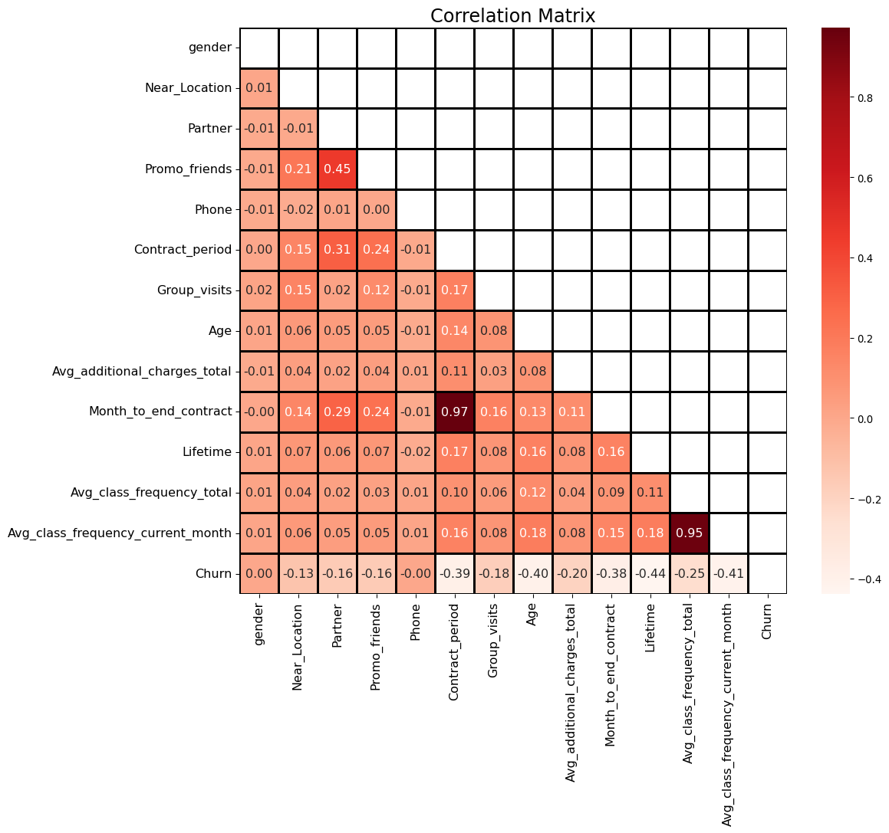
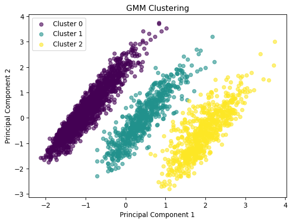

# Customer Churn Prediction


## Problem Statement

Predicting when a customer will stop doing business with a company is an
important problem for many businesses. This is especially important for
subscription based models like gyms, which rely on customers paying
monthly without fully utilizing the services. In this project, we will
focus on analyzing customer data for a gym to understand the factors
that influence customer churn. The goal is to identify customers who are
at risk of leaving this gym and provide recommendations to retain these
customers.

## Data

The data was collected on
[kaggle](https://www.kaggle.com/datasets/adrianvinueza/gym-customers-features-and-churn/data).
It is comprised of 13 features, and a binary target `Churn`. The data
has no missing values and has already been converted into numerical
values. The data dictionary is shown below.

<table>
<colgroup>
<col style="width: 32%" />
<col style="width: 67%" />
</colgroup>
<thead>
<tr>
<th>Feature</th>
<th>Description</th>
</tr>
</thead>
<tbody>
<tr>
<td><code>gender</code></td>
<td><p>Customer’s gender</p>
<p>0: Male</p>
<p>1: Female</p></td>
</tr>
<tr>
<td><code>Near_location</code></td>
<td><p>Does the customer live or work in the neighborhood of the
gym?</p>
<p>0: No</p>
<p>1: Yes</p></td>
</tr>
<tr>
<td><code>Partner</code></td>
<td><p>Does the customer work for an associated company that provides
discounts?</p>
<p>0: No</p>
<p>1: Yes</p></td>
</tr>
<tr>
<td><code>Promo_friends</code></td>
<td><p>Did the customer originally sign up with the “bring a friend”
discount offer?</p>
<p>0: No</p>
<p>1: Yes</p></td>
</tr>
<tr>
<td><code>Phone</code></td>
<td><p>Did the customer provide their cell phone number?</p>
<p>0: No</p>
<p>1: Yes</p></td>
</tr>
<tr>
<td><code>Contract_period</code></td>
<td>Length of customer’s contract (months)</td>
</tr>
<tr>
<td><code>Group_visits</code></td>
<td><p>Does the customer’s membership include group visits?</p>
<p>0: No</p>
<p>1: Yes</p></td>
</tr>
<tr>
<td><code>Age</code></td>
<td>Customer’s age (years)</td>
</tr>
<tr>
<td><code>Avg_additional_charges_total</code></td>
<td>Average amount spend per week on extras (USD)</td>
</tr>
<tr>
<td><code>Month_to_end_contract</code></td>
<td>Time remaining on customer’s contract (months)</td>
</tr>
<tr>
<td><code>Lifetime</code></td>
<td>Amount of time since customer first signed up (months)</td>
</tr>
<tr>
<td><code>Avg_class_frequency_total</code></td>
<td>Average number of group classes attended each week over customer’s
<code>Lifetime</code></td>
</tr>
<tr>
<td><code>Avg_class_frequency_current_month</code></td>
<td>Average number of group classes attended per week in the current
month</td>
</tr>
<tr>
<td><code>Churn</code></td>
<td><p>Did the customer leave the gym at the end of the month?</p>
<p>0: No</p>
<p>1: Yes</p></td>
</tr>
</tbody>
</table>

## Project Structure

### 1. Exploratory Data Analysis (EDA): [`gym_churn_eda.ipynb`](gym_churn_eda.ipynb)

The first step in this project is to perform EDA on the data. We explore
the distribution of the features using various plots to get a better
understanding of our customer demographic. We also visualize the churn
likelihood based on factors like `Lifetime`,
`Avg_class_frequency_current_month`, and `Month_to_end_contract`.
Finally, we analyze the correlation between features to better
understand how each feature influences whether or not a customer will
leave the gym at the end of the month.

``` python
import pandas as pd
import numpy as np
import matplotlib.pyplot as plt
import seaborn as sns

df = pd.read_csv('data/gym_churn_us.csv')
corr_mat = df.corr()

fig, ax = plt.subplots(figsize=(12,10))

mask = np.triu(np.ones_like(corr_mat, dtype=bool))

sns.heatmap(corr_mat, annot=True, cmap='Reds', linecolor='black', linewidths=2, 
            mask=mask, annot_kws={"fontsize":12}, fmt='.2f', ax=ax)
ax.set_xticklabels(ax.get_xticklabels(), fontsize=12)
ax.set_yticklabels(ax.get_yticklabels(), fontsize=12)
plt.title('Correlation Matrix', fontsize=18)
plt.show()
```



We find that `Churn` is mostly influenced by `Age`,
`Contract_period`,`Month_to_end_contract`,`Lifetime`, and`Avg_class_frequency_current_month\`.

### 2. Clustering: [`gym_churn_clustring.ipynb`](gym_churn_clustring.ipynb)

The next step in this project is to perform customer segmentation. We
group customers together based on how similarly they behave. We start by
performing principal component analysis (PCA) to visualize the data in
2-dimensional space. Because we find three distinct, elliptical
clusters, we use Gaussian Mixture Model with 3 clusters to perform
segmentation. We are then able to analyze the different behaviors of
each clusters by comparing their features using various plots.

``` python
from sklearn.model_selection import train_test_split
from sklearn.decomposition import PCA
from sklearn.preprocessing import RobustScaler
from sklearn.mixture import GaussianMixture

X = df.drop('Churn', axis=1)
y = df['Churn']

X_train, X_test, y_train, y_test = train_test_split(X, y, test_size=0.2, random_state=0)

# perform PCA to reduce dimensionality of data for visualizations
scaler = RobustScaler()
n_components = 2
pca = PCA(n_components=n_components)
X_train_norm = scaler.fit_transform(X_train)
X_train_pca = pca.fit_transform(X_train_norm)

# perform clsutering
n_components = 3
gmm = GaussianMixture(n_components=n_components, random_state=0)
labels_train = gmm.fit_predict(X_train_pca)

# plot clusters
fig, ax = plt.subplots()
cmap = plt.cm.get_cmap('viridis')
colors = {i: cmap(i / (n_components - 1)) for i in range(n_components)}
for i in range(n_components):
  cluster = X_train_pca[labels_train == i]
  ax.scatter(cluster[:, 0], cluster[:, 1], color=colors[i], label=f'Cluster {i}', s=30, alpha=0.6)
ax.set_title("GMM Clustering")
ax.set_xlabel("Principal Component 1")
ax.set_ylabel("Principal Component 2")
ax.legend()
plt.show()
```



We find that each of the three distinct clusters have very different
characteristics as shown in the table below. The churn rates between the
three clusters are significantly different from one another.

<table style="width:98%;">
<colgroup>
<col style="width: 41%" />
<col style="width: 18%" />
<col style="width: 18%" />
<col style="width: 18%" />
</colgroup>
<thead>
<tr>
<th>Variable</th>
<th>Cluster 0 Mean</th>
<th>Cluster 1 Mean</th>
<th>Cluster 2 Mean</th>
</tr>
</thead>
<tbody>
<tr>
<td><code>gender</code></td>
<td>0.498577</td>
<td>0.523256</td>
<td>0.513907</td>
</tr>
<tr>
<td><code>Near_Location</code></td>
<td>0.810472</td>
<td>0.863372</td>
<td>0.936424</td>
</tr>
<tr>
<td><code>Partner</code></td>
<td>0.348890</td>
<td>0.569767</td>
<td>0.721854</td>
</tr>
<tr>
<td><code>Promo_friends</code></td>
<td>0.212863</td>
<td>0.376453</td>
<td>0.490066</td>
</tr>
<tr>
<td><code>Phone</code></td>
<td>0.909505</td>
<td>0.902616</td>
<td>0.913907</td>
</tr>
<tr>
<td><code>Contract_period</code></td>
<td>1.000000</td>
<td>6.130814</td>
<td>12.000000</td>
</tr>
<tr>
<td><code>Group_visits</code></td>
<td>0.344337</td>
<td>0.449128</td>
<td>0.561589</td>
</tr>
<tr>
<td><code>Age</code></td>
<td>28.729084</td>
<td>29.425872</td>
<td>29.770861</td>
</tr>
<tr>
<td><code>Avg_additional_charges_total</code></td>
<td>138.295965</td>
<td>149.710346</td>
<td>165.677338</td>
</tr>
<tr>
<td><code>Month_to_end_contract</code></td>
<td>1.000000</td>
<td>5.565407</td>
<td>10.965563</td>
</tr>
<tr>
<td><code>Lifetime</code></td>
<td>3.165623</td>
<td>4.145349</td>
<td>4.671523</td>
</tr>
<tr>
<td><code>Avg_class_frequency_total</code></td>
<td>1.802468</td>
<td>1.959306</td>
<td>1.992757</td>
</tr>
<tr>
<td><code>Avg_class_frequency_current_month</code></td>
<td>1.616150</td>
<td>1.900362</td>
<td>1.985776</td>
</tr>
<tr>
<td><code>Churn</code></td>
<td>0.428002</td>
<td>0.132267</td>
<td>0.026490</td>
</tr>
</tbody>
</table>

Based on this data, we can break down the clusters as follows: \###
Cluster 0: New Year’s Resolutioners \* Short contract lengths \* Likely
to leave soon

### Cluster 1: Average Gym Goer

-   Characteristics in between Cluster 0 and Cluster 2
    -   Not extremely loyal customers but not uncommitted

### Gym Junkie

-   Longer contract lengths
-   Loyal customers

**Recommendations**

* Focus attention on Cluster 0. These members are the ones most at risk of leaving
* Keep members in clusters 1 and 2 engaged to prevent them from migrating to cluster 0
  * Reward members in these clusters for their loyalty to your gym

### 3. Prediction: [`gym_churn_modeling.ipynb`](gym_churn_modeling.ipynb)

Finally, we can predict whether or not each customer will leave the gym
at the end of the month. We will evaluate the performances of four
different models: 1. Logistic Regression 2. Support Vector Machine (SVM)
with Radial Basis Function (RBF) kernel 3. Gaussian Naive Bayes 4.
Extreme Gradient Boost (XGBoost)

Each of these models is evaluated based on their Accuracy, Precision,
Recall, F1 score, and Receiver Operator Characteristic Area Under the
Curve (ROC AUC).

<table style="width:95%;">
<colgroup>
<col style="width: 27%" />
<col style="width: 13%" />
<col style="width: 14%" />
<col style="width: 13%" />
<col style="width: 13%" />
<col style="width: 13%" />
</colgroup>
<thead>
<tr>
<th>Model</th>
<th>Accuracy</th>
<th>Precision</th>
<th>Recall</th>
<th>F1 Score</th>
<th>ROC AUC</th>
</tr>
</thead>
<tbody>
<tr>
<td>Logistic Regression</td>
<td>0.92</td>
<td>0.83</td>
<td>0.84</td>
<td>0.83</td>
<td>0.97</td>
</tr>
<tr>
<td>SVM</td>
<td>0.93</td>
<td>0.85</td>
<td>0.85</td>
<td>0.85</td>
<td>0.97</td>
</tr>
<tr>
<td>Gaussian Naive Bayes</td>
<td>0.81</td>
<td>0.58</td>
<td>0.91</td>
<td>0.70</td>
<td>0.93</td>
</tr>
<tr>
<td>XGBoost</td>
<td>0.94</td>
<td>0.88</td>
<td>0.87</td>
<td>0.88</td>
<td>0.98</td>
</tr>
</tbody>
</table>

XGBoost has the highest performance by all metrics except for recall.
Gaussian Naive Bayes performs the best in this regard, but worse
everywhere else. However, Gaussian Naive Bayes has the lowest precision.
This means that while this method overestimates a customer’s likelihood
of leaving the gym. This can lead to identifying customers early, but it
also leads to wasted efforts trying to retain customers that are not
leaving.

## Conclusions
Given the analysis, we recommend focussing efforts on members with the following characteristics:

### New members
- Keep new members engaged. These first few months are the most important for new members as this is when they are most likely to leave. 

### Short contract periods
- Members with short contract periods are less likely to stay than other members. Reminding these members to renew their contracts will help them retain their membership status. Additionally, the gym may provide incentives for longer contract periods such as lower rates for a lump sum payment upfront.

### Short time remaining on contracts
- As a member's contract expiration date approaches, they are more at risk of leaving the gym. We can keep these members from leaving by reminding them of their current benefits, and providing loyalty bonuses for staying.

### Members in cluster 0
- Members in this cluster have a higher probabilitiy of leaving the gym than members in clusters 1 and 2.
- These members tend to have shorter contract lengths (and thereby less time remaining on their contracts), so the same strategies for short contract periods and short time remaining can be applied to these members.
- These members also tend have a higher barrier to entry (no promo/partner discounts, longer commute, etc.), so keeping these members motivated to stay with the gym is important. Customers in this group could be incentivized to stay by using the following:
    - Limited time offers
    - Loyalty perks
    - More personalized experience

## Reproducability
Clone the repository using the following command:
```bash
git clone https://github.com/kennethwirjadisastra/customer_churn.git
```
The data is located in the [/data](/data) subdirectory, but it can also be downloaded from [kaggle](https://www.kaggle.com/datasets/adrianvinueza/gym-customers-features-and-churn/data).
The dependencies for this project are listed in [`requirements.txt`](requirements.txt). They can be installed by running 
```bash
pip install -r requirements.txt
```
The notebooks are to be run in the following order:
1. [`gym_churn_eda.ipynb`](gym_churn_eda.ipynb)
2. [`gym_churn_clustering.ipynb`](gym_churn_clustering.ipynb)
3. [`gym_churn_modeling.ipynb`](gym_churn_modeling.ipynb)